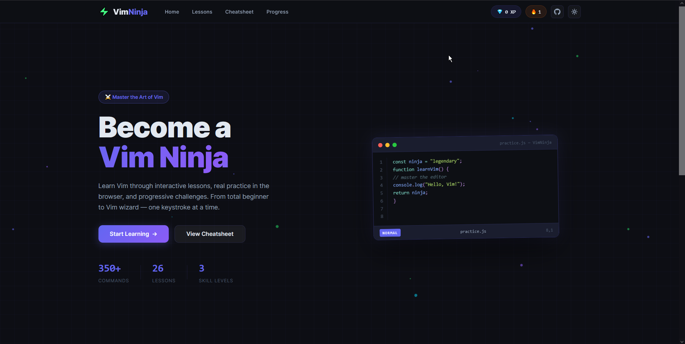
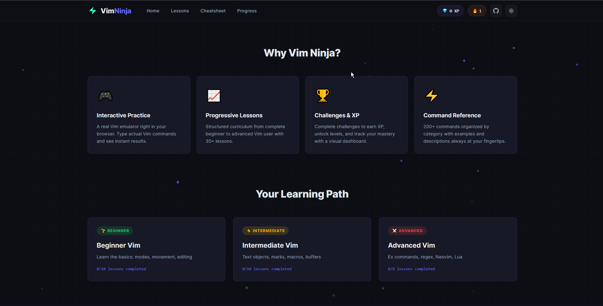
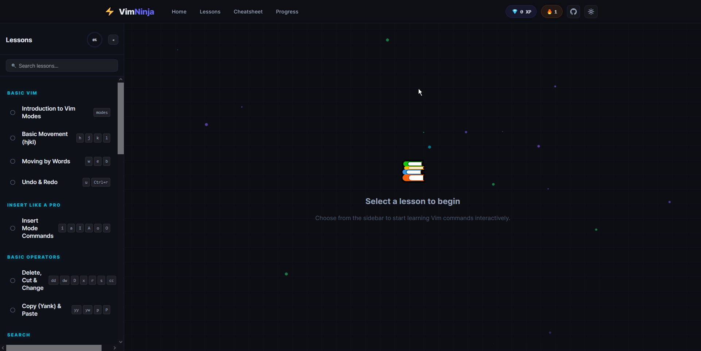
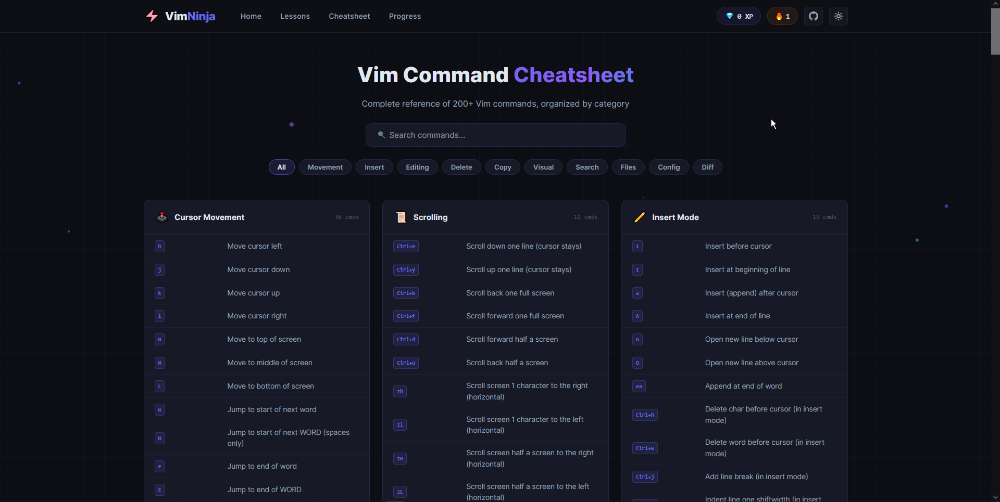
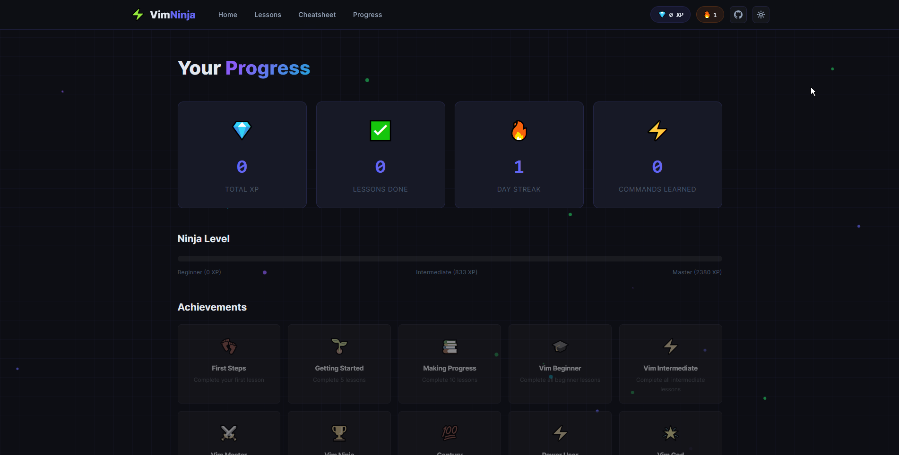
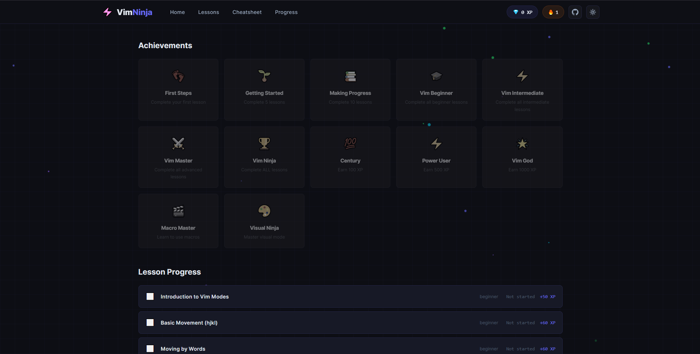

<div align="center">
  

  <h1>VimNinja</h1>

  <p><strong>Self-hosted Vim Lab for Hands-on Learning</strong></p>

</div>

VimNinja runs a real Vim inside two Docker container and provide it with a browser-based terminal to achieve lessons, real practice, and progressive challenges.


## Screenshots

| | | |
|---|---|---|
|  |  |  |
|  |  |  |


---

## 🚀 Quick Start

### 🌐 Option A: Run directly in the Browser (No setup)
Just open `index.html` in your browser:
```bash
# Clone Repo
git clone https://github.com/meibraransari/vim-ninja.git
cd vim-ninja
start index.html
```

---

### 🐳 Option B: Run via Docker (Nginx server + Real Terminal Vim Sandbox)
We provide a containerized setup to run the browser platform via Nginx and spin up an isolated interactive playground containing classic `Vim`, `Neovim`, `tmux`, and `ripgrep` for practicing on real files.


```bash
# 1. Setup Environment
cp .env.example .env

# 2. Start Services
docker compose up -d

# 3. Access the Real Vim Sandbox | To open a shell and practice using real Vim/Neovim inside the container:
docker exec -it vimninja-sandbox bash
```

* The web application will be accessible at: **`http://localhost:8080`**
* Standard Nginx logs and your sandbox home directory (`/home/ninja`) are persisted in named volumes.

---

## 🛠️ Makefile Reference
If you have `make` installed, you can use these helper commands to control your Docker setup:

| Command | Action |
|---------|--------|
| `make install` | Create `.env` from `.env.example` |
| `make up` | Start all services in the background |
| `make down` | Stop all services and containers |
| `make build` | Rebuild images from scratch (no cache) |
| `make logs` | Follow logs from all containers |
| `make ps` | Show status of running containers |
| `make shell-sandbox` | Connect to the interactive bash sandbox |
| `make vim-sandbox` | Directly start Vim on the first practice exercise |
| `make nvim-sandbox`| Directly start Neovim on the first practice exercise |
| `make clean` | Stop containers and wipe associated Docker volumes |


---

## 📁 Project Structure

```
vim-ninja/
├── index.html      — Main app shell
├── style.css       — Complete dark-theme styling
├── data.js         — All lessons, cheatsheet, achievements
├── vim-engine.js   — Browser Vim emulator (full mode system)
└── app.js          — App controller & page routing
```

---

## 🎮 Features

| Feature | Description |
|---------|-------------|
| **Vim Emulator** | Real Vim modes: Normal, Insert, Visual, Visual Line, Visual Block, Command, Replace, Search |
| **200+ Commands** | Full cheatsheet with search and category filters |
| **XP System** | Earn XP for completing lessons |
| **Achievements** | 12 unlock-able achievements |
| **Progress Tracking** | LocalStorage-based persistence |
| **Challenges** | Each lesson has a validation challenge |
| **Hints** | Built-in hint system for each exercise |

---

## 🏆 Achievements

| Achievement | Requirement |
|-------------|-------------|
| 👣 First Steps | Complete 1 lesson |
| 🌱 Getting Started | Complete 5 lessons |
| 📚 Making Progress | Complete 10 lessons |
| 🎓 Vim Beginner | Complete all beginner lessons |
| ⚡ Vim Intermediate | Complete all intermediate lessons |
| 🥷 Vim Master | Complete all advanced lessons |
| 🏆 Vim Ninja | Complete ALL lessons |
| 💯 Century | Earn 100 XP |
| ⚡ Power User | Earn 500 XP |
| 🌟 Vim God | Earn 1000 XP |

---

## 📚 Reference Materials Used

- `Vim_Cheat_Sheet` — Full command reference
- `basic_vim.md` — CKA-focused shortcuts
- `vim_theme` — vimrc configuration options
- `vimrc/` — Real vimrc examples

---

## 🔧 Tech Stack

- **Pure HTML + CSS + JavaScript** — No dependencies, no build step
- **Custom Vim Engine** — Full modal editing emulation in browser
- **LocalStorage** — Progress persistence
- **Google Fonts** — JetBrains Mono + Inter

---

## 💼 Connect with Me 👇😊

*   🔥 [**YouTube**](https://www.youtube.com/@DevOpsinAction?sub_confirmation=1)
*   ✍️ [**Blog**](https://ibraransari.blogspot.com/)
*   💼 [**LinkedIn**](https://www.linkedin.com/in/ansariibrar/)
*   👨‍💻 [**GitHub**](https://github.com/meibraransari?tab=repositories)
*   💬 [**Telegram**](https://t.me/DevOpsinActionTelegram)
*   🐳 [**Docker Hub**](https://hub.docker.com/u/ibraransaridocker)

### ⭐ If You Found This Helpful...

***Please star the repo and share it! Thanks a lot!*** 🌟